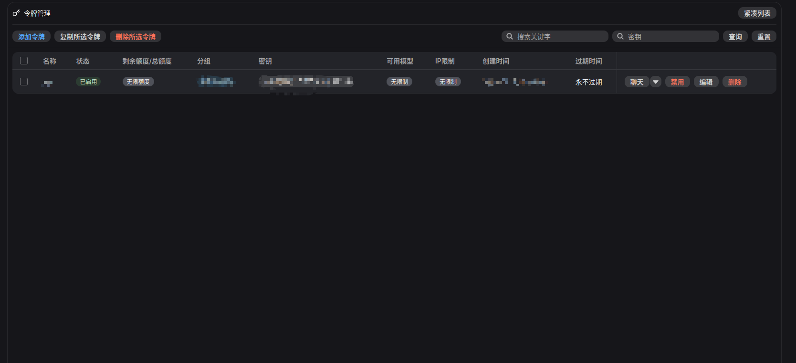
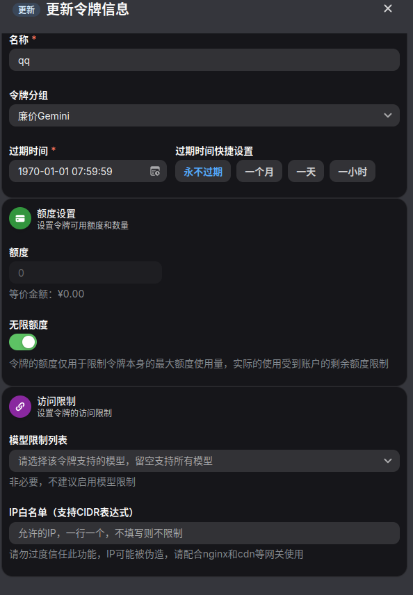

# 令牌管理界面指南

## 1. 主界面概览

主界面主要用于 API 令牌的**新增、删除及禁用**操作。关于令牌的详细配置与高级设置，请点击特定令牌进入“编辑”模式，详见下文。

## 2. 令牌设置详解

在令牌编辑界面中，各项配置参数说明如下：

### 2.1 分组 (Group)
*   **功能**：决定该令牌可访问的模型列表及对应的费用倍率。
*   **说明**：不同分组对应不同的上游渠道资源。高价值分组通常提供更稳定的服务连接。
    *   *注：除非您需要同时调用所有可用模型，否则不建议选择 `auto` 分组，请根据实际业务需求选择特定分组以优化成本与稳定性。*

### 2.2 过期时间 (Expiration)
*   **功能**：设定令牌的有效期限，超时后自动失效。
*   **建议**：出于安全考量，强烈建议**开启过期时间**并避免选择“永不过期”。这能有效降低因令牌泄露导致的长期安全风险。

### 2.3 额度限制 (Quota Limit)
*   **功能**：设定令牌的最大可用额度（金额或 Token 数量）。
*   **建议**：无论您是否能精确预估用量，均建议根据预算开启此限制。当消耗达到设定阈值时，令牌将自动停止服务，防止产生意外高额费用。

### 2.4 模型白名单 (Model Restrictions)
*   **功能**：限制该令牌仅能访问指定的模型。
*   **说明**：按需配置即可。若留空，则表示该令牌可使用当前“分组”下的所有模型。

### 2.5 IP 白名单 (IP Whitelist)
*   **功能**：限制仅允许特定 IP 地址使用该令牌。
*   **建议**：请谨慎使用。由于网络环境可能存在波动，过于严格的 IP 限制可能导致服务不可用。建议优先通过妥善保管令牌本身及设置额度/过期时间来保障安全。