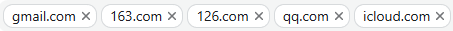
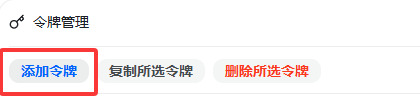
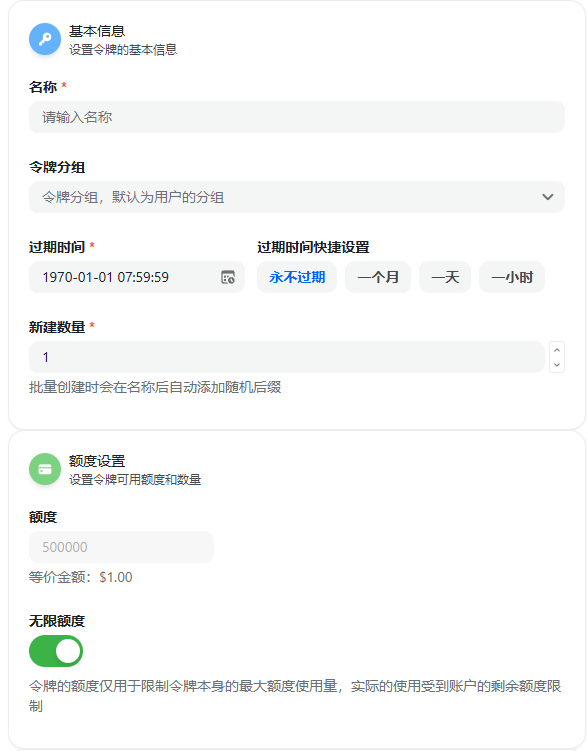

# quick start

# RinkoAI 文档

欢迎使用 RinkoAI！本文档将帮助您快速了解并开始使用 RinkoAI 服务。

<a href="https://rinkoai.com/">
  
</a>

# 🤔 什么是 RinkoAI？

---

RinkoAI 是一个**专业的 API 中转站点**，致力于提供**稳定可靠**的 AI 服务。

- 🔌 **标准 OpenAI 接口** - 兼容大量应用，一键接入
- 💰 **价格优势** - 相比其他平台更具性价比
- 🚀 **稳定服务** - 专业运维，持续可用
- ✅ **真实模型** - 不使用假模型，保证服务质量

### 价格对比

|模型|RinkoAI|其他平台|
| -------------------| ---------| ----------------------|
|DeepSeek-V3|**1元输入 + 2元输出**|2元输入 + 8元输出|
|Claude-4.0-sonnet|**5.4元输入 + 27元输出**|8.2元输入 + 41元输出|
|Gemini-2.0-flash|**完全免费**|0.6元输入 + 输出|

# 🚀 快速开始

---

## 1\. 注册账号

1. 访问 [RinkoAI 官网](https://rinkoai.com)
2. 点击"注册"页面
3. 使用邮箱注册账号（推荐使用 QQ 邮箱：`你的QQ号@qq.com`​）  
   **重要提示**  
   本站仅支持特定邮箱后缀，如需添加其他后缀请联系站主（不接受 Outlook）  
  

## 2\. 获取测试余额

新用户注册即可获得 **0.2 元测试余额**，可直接用于测试各项功能。

## 3\. 创建 API Key

### 步骤一：进入令牌管理

在网站中点击令牌管理按钮：  
​

### 步骤二：创建新令牌

点击创建令牌按钮：  
​

### 步骤三：配置令牌设置

**新用户推荐配置：**

- **分组选择**：Auto（自动分组）
- **额度设置**：无限额度
- **有效期**：永不过期  
  ​  
  **Auto 分组说明**  
  Auto 分组会按以下优先级自动选择可用模型：  
  画图分组 → 开源模型 → 逆向 → 开源模型求稳 → 兼容Gemini → Claude\_AWS → 其他官转 → 超速模型 → V0官转 → 官逆按次Claude

## 4\. 开始使用

创建成功后，您会看到 **"聊天"** 按钮，点击即可自动导入 **Cherry Studio** 开始使用。  
🔧 接入第三方应用

---

### API 配置信息

```plaintext
Base URL: https://rinkoai.com/v1
API Key: 您刚才创建的令牌
```

### 使用示例

```bash
curl -X POST "https://rinkoai.com/v1/chat/completions" 
  -H "Content-Type: application/json" 
  -H "Authorization: Bearer YOUR_API_KEY" 
  -d '{
    "model": "gemini-2.0-flash",
    "messages": [{"role": "user", "content": "Hello!"}]
  }'
```

# 📞 联系支持

---

如有任何问题，请通过以下方式联系我们：

- 官网：[https://rinkoai.com](https://rinkoai.com)
- QQ群聊: 1054544611

---

*感谢选择 RinkoAI，祝您使用愉快！*  🎉
