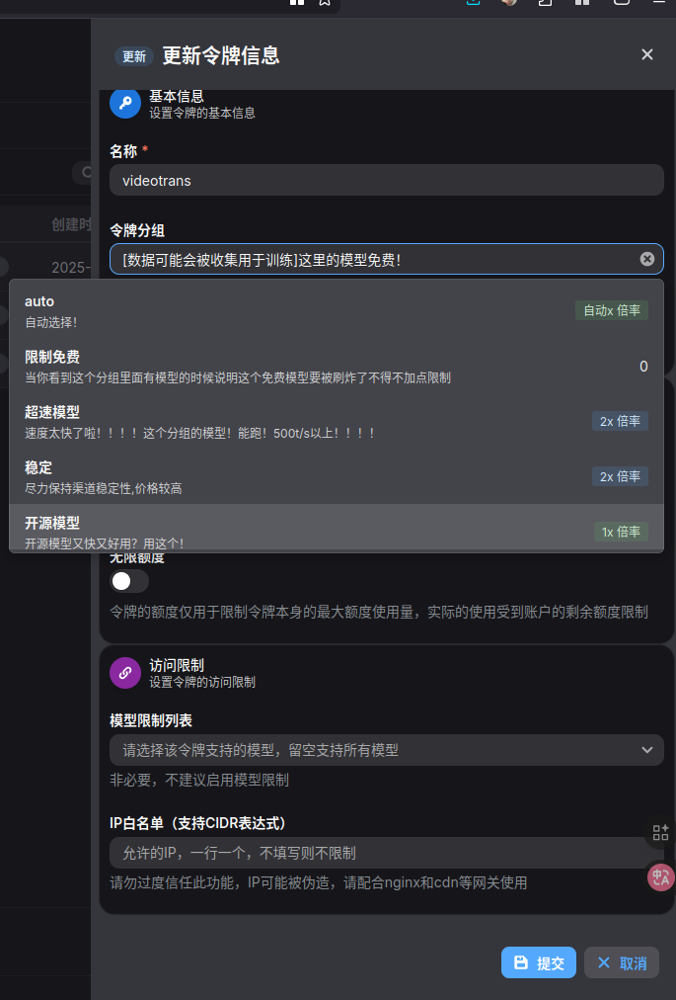
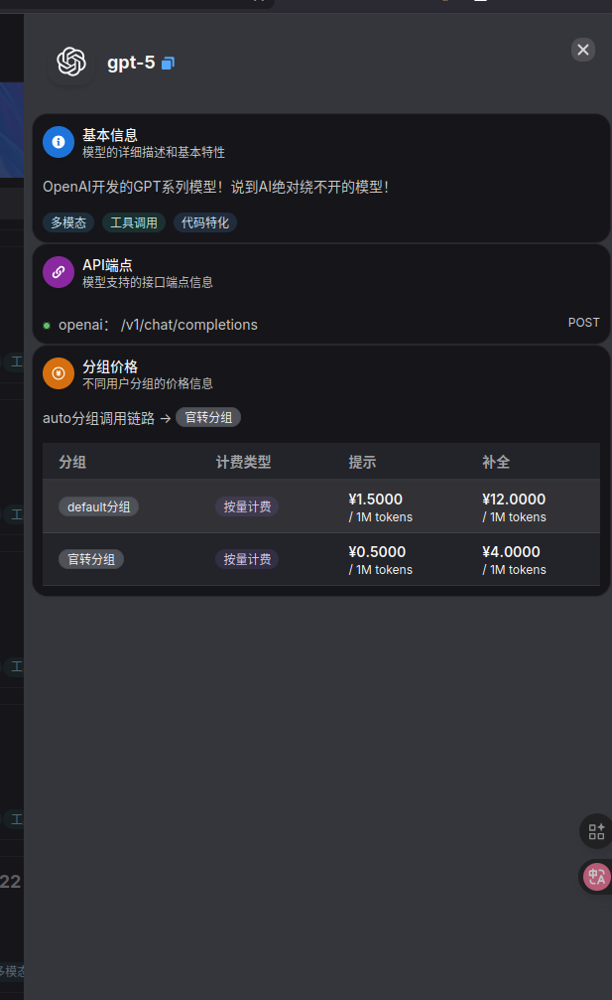

# 分组机制

# 什么是分组?

因为AI大模型的能力其实都是有特点的.

例如:

- Claude和Gemini擅长编码和逻辑问题问答
- OpenAI擅长文字处理，且其在5.0之后的版本，官方将其改为了更加冷淡(相比较4o)的对话风格.
- 国内各模型则主要是性价比，在同等价格下，**如果任务不太复杂，且对价格比较敏感**，可以考虑Qwen等国内模型。

且对于本站，各个模型很多时候成本是不一致的。为了方便管理和缓解回复速度的压力，会使用相对多的分组。

# 分组的计价方式

如上面所说，不同分组的价格会不同，即使是同种模型。

价格等于：

$$
\text{模型实际价格} = \text{模型基础价格} \times \text{分组倍率}
$$

在控制台的令牌管理可以选择分组，这里也可以查看各个分组的倍率。
    

其实也可以在模型广场查看在各个分组下的价格

---

# 关于分组的区别

很多时候都可以看分组的介绍，一般来说。价格越贵，其回复速度更快，限额越少。也更加稳定。

可以看看现在的一些例子

- **Claude_Aws**: 使用的是Amazon(亚马逊)的Claude服务,通常比较稳定
- **开源模型**：其实就是Qwen的开源模型和一些其他的开源模型。可能性能上比不上闭源模型，但是胜在性能稳定，价格便宜，且有类似于POP Planner这种针对部分场景训练的特化模型
- **Gemini**：神秘Google的模型(x

所以都可以按照自己的需求来挑选

# 写在最后

虽然在quick start里说可以直接选择Auto，但是如果你真的不是小白，出于成本考虑，你可以选择非Auto分组。前提是你知道你需要什么模型
